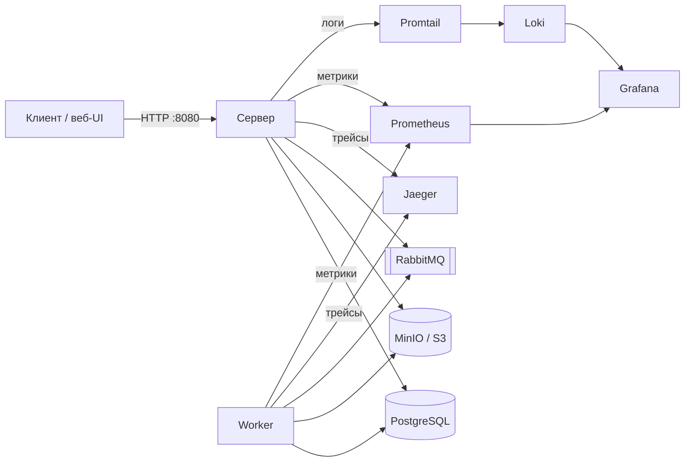
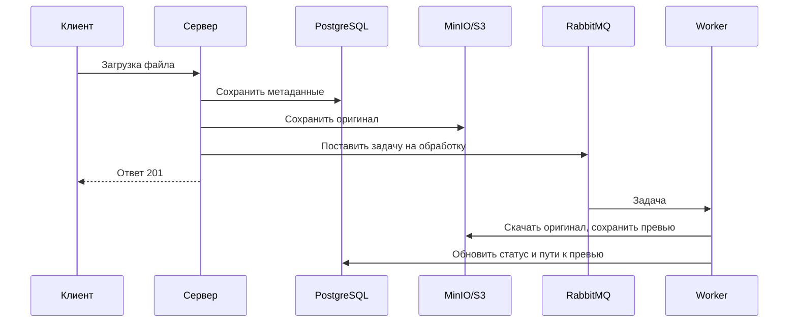
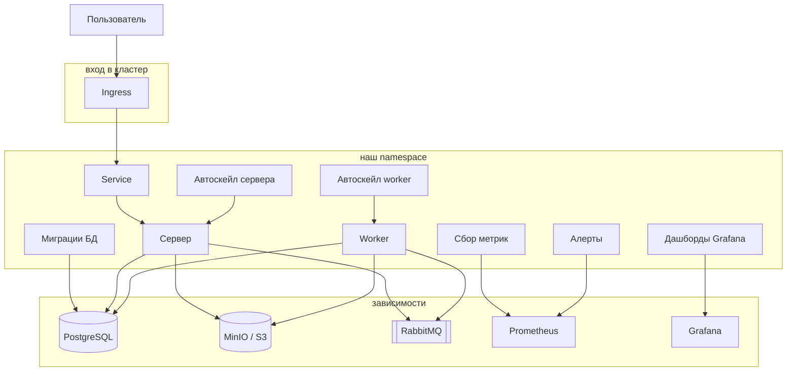

# Архитектура GophProfile

GophProfile — сервис аватарок. Пользователь загружает картинку через API,
сервер сохраняет оригинал и сразу отвечает. Тяжёлую работу (миниатюры) делает
отдельный worker в фоне.

Внутри три хранилища:

- **PostgreSQL** — кто загрузил, статус, пути к файлам
- **MinIO / S3** — сами файлы
- **RabbitMQ** — очередь задач между сервером и worker’ом

---

## Локальный запуск

`docker compose up` поднимает всё сразу: API, worker, базу, очередь, хранилище
и метрики, логи, трейсы.

Приложение общаются только с API. База, файлы и очередь —
общие для API и фонового worker’а. Prometheus с Grafana нужны, чтобы видеть,
не упал ли сервис и как он справляется с нагрузкой.

---

## Что происходит при загрузке аватарки

1. Клиент шлёт файл на `POST /api/v1/avatars`.
2. Сервер кладёт оригинал в S3, пишет запись в БД и кидает задачу в очередь.
3. Клиенту сразу приходит «готово» (201) — ждать миниатюры не нужно.
4. Worker забирает задачу, режет превью и обновляет статус в БД.

---

## Деплой в Kubernetes

Запрос сначала попадает на Ingress, затем на Service,
который распределяет нагрузку между репликами API.

Worker снаружи недоступен: он читает задачи из очереди и отдаёт метрики
в Prometheus.

Настройки лежат в ConfigMap, секреты (пароли, URI) — в Secret.
При росте нагрузки HPA увеличивает число подов. NetworkPolicy задаёт,
какие сервисы вообще могут общаться друг с другом.

Где лежат манифесты:

| Что | Куда смотреть |
|---|---|
| Готовые yaml для `kubectl apply` | `deploy/k8s/` |
| Helm-чарт (удобнее для окружений) | `deploy/helm/gophprofile/` |
| SQL миграций для Helm | `deploy/helm/gophprofile/files/migrations/` |

---

## Устойчивость к сбоям

**Недоступны БД, S3 или очередь**  
После нескольких ошибок подряд circuit breaker на время отключает вызовы
к этой зависимости и возвращает `503`. Примерно через 30 секунд делает
повторную попытку.

**Слишком много запросов**  
На API включён rate limit (`RATE_LIMIT_RPS` / `RATE_LIMIT_BURST`).
Превышение лимита — ответ `429`.

**Остановка или обновление пода**  
Под сначала убирают из балансировки, дают завершить текущие запросы,
затем останавливают процесс. Worker аналогично заканчивает текущую задачу
и завершается.

---

## Мониторинг и алерты

Два дашборда в Grafana:

- **Service Overview** — запросы, ошибки, задержки, загрузки, глубина очереди
- **Kubernetes** — число подов, CPU/память, HPA, активные алерты

Алерты (PrometheusRule):

| Алерт | Когда срабатывает |
|---|---|
| TargetDown | Prometheus не получает метрики сервиса |
| PodNotReady | Часть подов не готова принимать трафик |
| HighErrorRate | Высокая доля ответов 5xx |
| HighLatency | Выросла задержка обработки запросов |
| QueueDepthHigh | В очереди накопилось слишком много задач |
| HPAAtMax | Достигнут максимум реплик при сохраняющейся нагрузке |

Подробности запуска и переменных окружения — в [README](../README.md).
Контракт API — в [openapi.yaml](./openapi.yaml).
